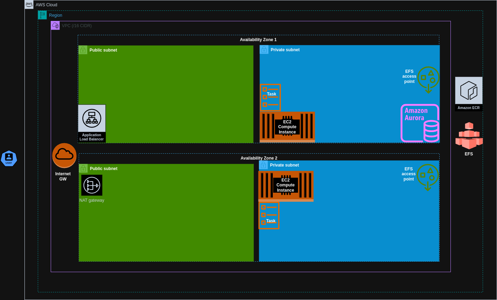

# Project to deploy wordpress app using ecs

AWS ECS infrastructure setup for deploying wordpress image provided as output of the wordpress image.

The wordpress application runs as a container using ecs service to ensure desired capacity. The container logs are accessible through AWS cloudwatch log group that uses the project name. An Aurora-MySQL Database is accessible to the ecs container applications. The credentials for the container are accessible through SSM parameter store

## Recommended Setup
### [Network Setup](modules/vpc)
- Custom VPC (CIDR /16)
- Internet and Nat GateWay
- Public and private subnet (/24)
- Public security group for internet access
- Private security group for ECS instances and rds cluster
- EFS security group for EFS access

### [Database Setup](modules/rds/)
- MySQL Aurora Cluster in private subnets
- RDS cluster instance
- SSM Parameter Store for database credentials

### [ECS Setup](modules/ecs)
- ECR Repo configuration
- CloudWatch log group for ECS tasks
- Launch Template for EC2
- Autoscaling group for ECS instances
- ECS cluster
- ECS capacity provider using autoscaling group
- ECS Task and service setup
- ECS Application Loadbalancer

### [ECS IAM](modules/ecs/ecs-iam.tf)
- EC2 instance profile with EC2 container service role policy attached
- ECS task role with allowed ecs-task permission
- ECS task execution role using ECSTaskExecutionRolePolicy

## Architecture Diagram

